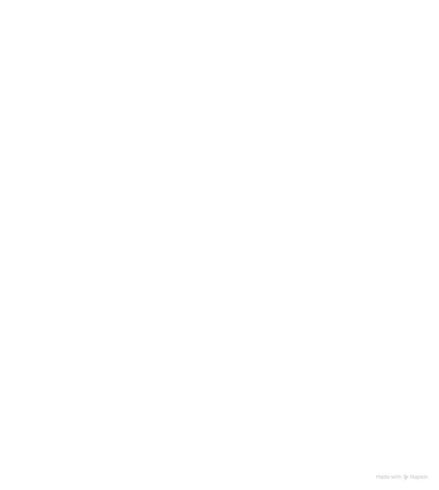

## AWS CloudFormation
* O AWS CloudFormation é o serviço da AWS usado para provisionar e gerenciar infraestrutura como código (IaC). Em vez de criar recursos manualmente no console, você descreve tudo em templates (YAML ou JSON), e o CloudFormation cuida de criar, configurar e atualizar automaticamente.
* Infraestrutura como código: descreve recursos como EC2, S3, RDS, VPC etc. em arquivos versionáveis.
* Automação: cria e atualiza ambientes inteiros com um único comando.
* Padrões reutilizáveis: você pode usar os mesmos templates para replicar ambientes (ex.: dev, teste, produção).
* Gerenciamento de dependências: ele entende a ordem de criação (ex.: cria a VPC antes das instâncias EC2).
* Stacks: os recursos são organizados em pilhas (stacks), fáceis de criar, atualizar e excluir.
* Rollback automático: se algo falhar, ele reverte para o estado anterior.
